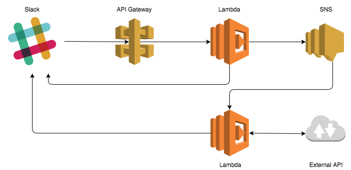

## Setting up a new slash command

1. Check `main.tf` and edit the region if required.
2. Zip the bot source `zip memebot.zip memebot.py`
3. Zip the bot worker source `zip memebot_worker.zip memebot_worker.py`
3. Run `terraform apply`.
4. Navigate to `https://<your-team-domain>.slack.com/services/new`
5. Search for and select "Slash Commands".
6. Enter a name for the command (eg "meme") and click "Add Slash Command Integration".
7. Fill in the command url from the terraform output.
8. Copy the token string from the integration settings and use it in the next section.
9. Add the slash command token to the parameter store with:

   `aws ssm put-parameter --name "memebot_slash_command_token" --type "SecureString" --value "<TOKEN>"`

